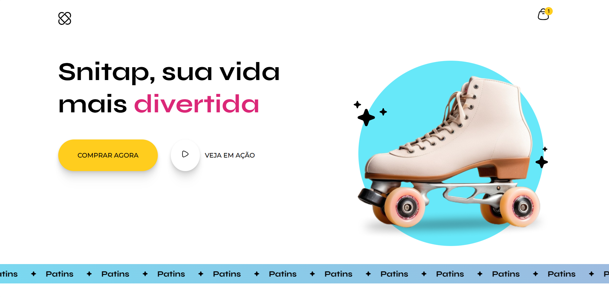

# 🛼 Snitap Patins

Projeto desenvolvido como parte dos estudos em animações CSS, inspirado por desafios da **Rocketseat**. O objetivo foi treinar **animações**, **transições** e construção visual apenas com **HTML** e **CSS**, resultando em uma página temática sobre patins, com imagens estilizadas e efeitos visuais suaves.

## 📸 Prévia



## 🚀 Tecnologias Utilizadas

- HTML5
- CSS3
- Animações e Transições CSS

## 🎯 Objetivo

O foco principal do projeto foi:

- Treinar habilidades com animações e transições em CSS
- Trabalhar com layout e posicionamento de imagens
- Criar uma interface visual agradável e moderna

## 💻 Como Visualizar

1. Clone o repositório:
   ```bash
   git clone https://github.com/seu-usuario/snitap-patins.git
